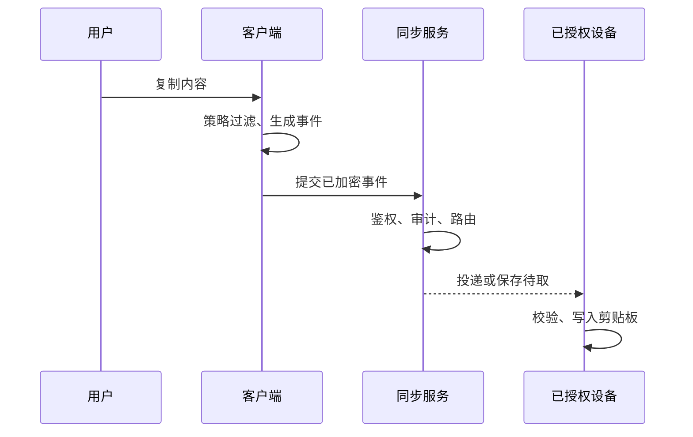
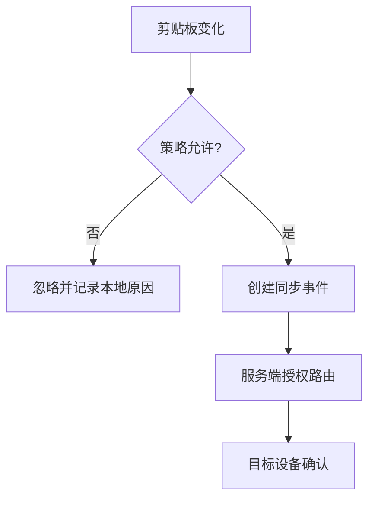
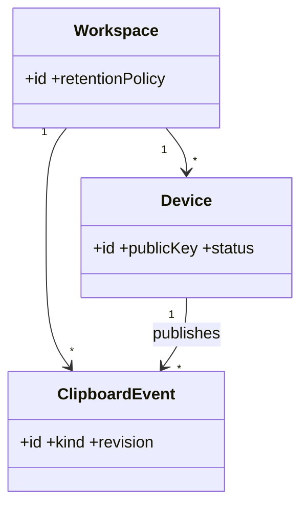

# 产品愿景与边界

## Purpose

定义 Remote Clipboard 的产品边界、受众和可验证的价值主张。本文件是功能取舍的最高层依据，不把“能经 TCP 发送内容”误认为产品完成。

## Background

仓库当前提供 Windows GUI、Wayland GUI、Linux CLI 和两个 C++ 中继服务入口。它们可同步文本和文件，但使用单一明文凭据、广播式会话和本地文件目录；这适合可信局域网试用，不足以构成可审计的团队协作服务。

## Design Goals

- 在用户明确授权的设备和工作区内，以低延迟同步文本、文件引用和受控文件内容。
- 让传输是否加密、数据保留多久、谁可接收均可见、可配置、可审计。
- 保持轻量本地部署，同时允许扩展为多租户、托管和移动端服务。

## Architecture

产品由设备客户端、控制平面、同步数据平面和可选插件组成。客户端只观察本地剪贴板并提交不可变事件；服务端依据工作区成员关系向授权设备投递，而非向所有 TCP 连接广播。

## Detailed Design

产品分为个人模式与团队模式。个人模式允许一个工作区、配对码和本地 SQLite；团队模式要求组织、设备审批、保留策略、审计和 PostgreSQL。同步默认只处理纯文本，文件传输须由策略显式允许；历史是独立能力，不以剪贴板缓存暗中留存。服务端从“文件副本仓库”升级为元数据索引加对象存储适配层。

## Sequence Diagrams

## Flow Charts

## UML when appropriate

## Future Extension

增加 macOS、移动端、工作区共享历史、企业 IdP 和按内容类型的 DLP 策略。任何新端都必须实现同一事件协议，而不是复用平台专有剪贴板代码。

## Risks

剪贴板天然可能含密码、令牌和个人数据；自动同步造成的误传播比传输失败更严重。文件传输还引入恶意文件、存储膨胀和跨平台路径语义风险。

## Trade-offs

默认最小同步范围和显式设备配对增加首次使用步骤，却减少静默数据外泄；服务端可见元数据换取可路由与审计能力，端到端加密内容则限制服务端检索与安全扫描。
