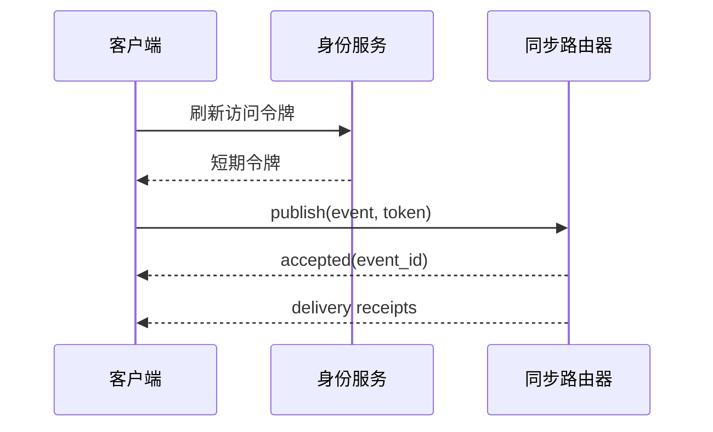
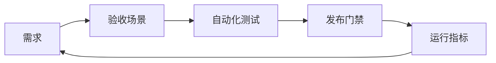
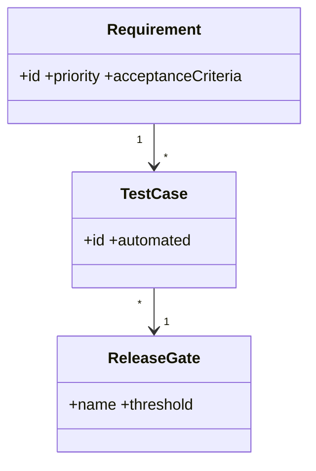

# 需求与验收基线

## Purpose

将产品目标转化为可测试的功能、非功能和兼容性要求，作为实现和验收的共同契约。

## Background

当前实现已具备文本、文件包、分块文件、TLS 开关、心跳和指数退避；但服务端不持久化会话、没有身份域或授权模型，GUI 与 CLI 的传输实现在不同位置重复。

## Design Goals

- 明确 MVP 与企业目标，避免把目标架构直接当作已实现特性。
- 要求每项同步可追溯、可拒绝、可重试且不形成无限回环。
- 使 Linux、Windows 和未来客户端在行为而非 UI 上一致。

## Architecture

需求以“客户端采集—事件提交—授权分发—客户端应用”四阶段组织。控制面负责用户、设备、工作区和策略；数据面只接收经认证的事件及其分块。

## Detailed Design

功能要求：文本 UTF-8 同步、文件清单及分块上传、按工作区路由、设备撤销、离线待取、可配置保留和下载目录。非功能要求：单事件端到端 P95 小于 500 ms（同区域在线设备，文本小于 64 KiB）；客户端不得阻塞 UI 线程；服务端按工作区隔离资源。安全要求：生产环境 TLS 1.3、短期访问令牌、设备密钥和不可逆密码哈希。兼容要求：服务器在迁移期接受现有换行分隔 JSON v1，只允许预配对旧设备接入。

## Sequence Diagrams

## Flow Charts

## UML when appropriate

## Future Extension

支持富文本、图片、剪贴板历史和冲突提示前，必须先定义 MIME 白名单、大小上限和用户可理解的授权交互。

## Risks

“同步全部格式”的需求会造成不可控隐私范围；离线可靠性与删除权、保留策略天然冲突。

## Trade-offs

强一致的全设备顺序会牺牲离线可用性；本项目选择每设备事件序列、最终投递和幂等应用，以换取网络分区下的可用性。
