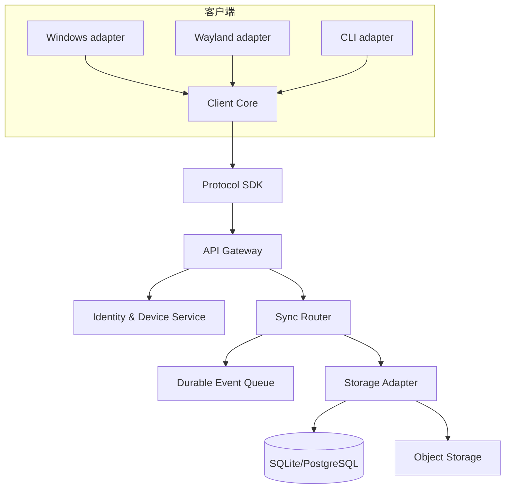
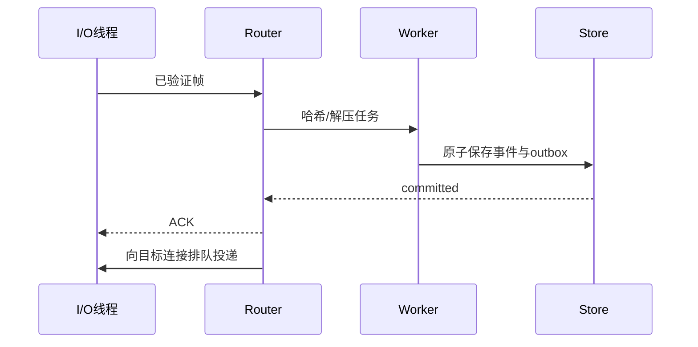
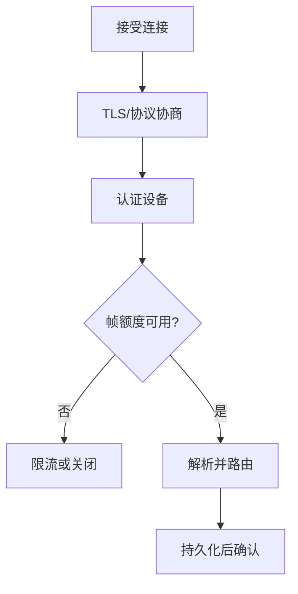
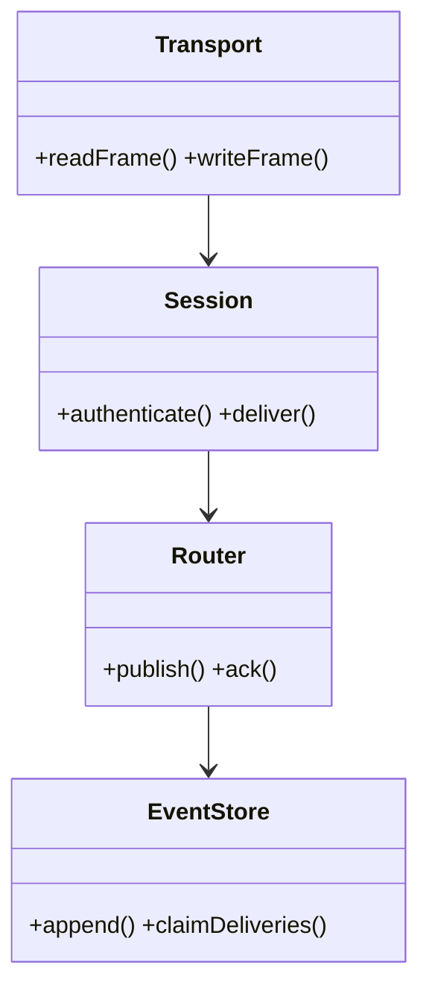

# 架构与演进设计

## Purpose

说明当前代码边界、已知架构债务和推荐的目标模块关系，指导重构而不掩盖现状。

## Background

当前可构建服务器是 `server_common`，由 `RemoteClipboardServer-64MB` 与 `RemoteClipboardServer-512MB` 以不同最大报文大小启动。每连接一个 detached 线程，使用互斥保护客户端映射并逐一写入广播。GUI 端是 Qt 事件循环；CLI 端轮询剪贴板和 socket。GUI 目录的 `tcpserver.*` 与 `server_main.cpp` 未被 CMake 编入目标，且协议与当前服务端不兼容。`RemoteClipboardServer-64MB/tcpserver.*` 亦未被 CMake 引用并含合并冲突标记，应视为历史文件。

## Design Goals

- 将协议、身份、存储、路由和平台剪贴板适配器解耦。
- 以有界并发和背压替代每连接无限制线程与同步广播。
- 允许同一业务核心驱动 GUI、CLI 和未来平台。

## Architecture

## Detailed Design

目标服务采用 acceptor、固定 I/O 线程和有界 worker pool；单连接顺序解析，CPU 密集的哈希、压缩和存储转交 worker，完成后回到连接的串行执行器。路由器以 `(workspace_id, event_id)` 去重，写入 outbox 后才确认发布；投递使用每设备游标。事件总线是进程内接口而非无约束全局单例，便于替换为消息代理。网络抽象统一定义 frame reader、writer、TLS、流控和超时；存储抽象定义事务、事件、设备游标与 blob 生命周期。

## Sequence Diagrams

## Flow Charts

## UML when appropriate

## Future Extension

服务发现使用 HTTPS 目录或 DNS SRV，客户端缓存签名的端点列表；插件只订阅经净化的领域事件，不进入网络收包路径。

## Risks

从广播模型迁移到持久化投递会增加运行组件和故障模式；异步队列若没有配额会将内存问题转为磁盘问题。

## Trade-offs

选择模块化单体而非一开始拆微服务：保留部署简单性，同时通过稳定接口为后续拆分留出边界。持久化确认增加延迟，却防止确认后数据消失。
