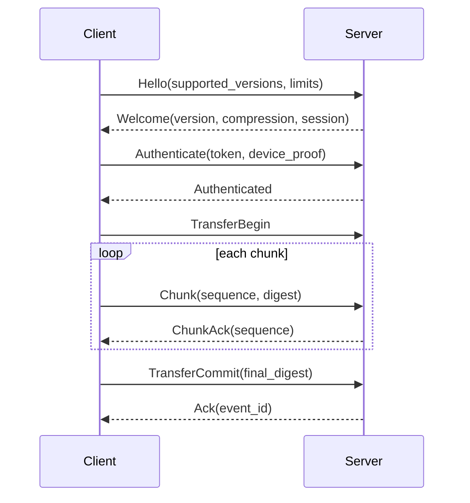
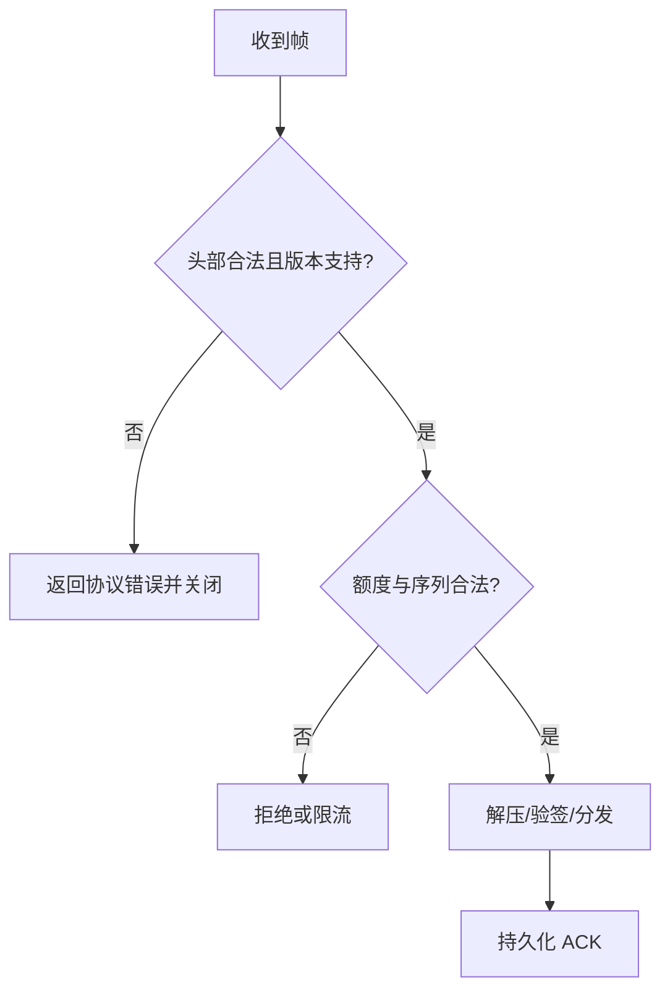
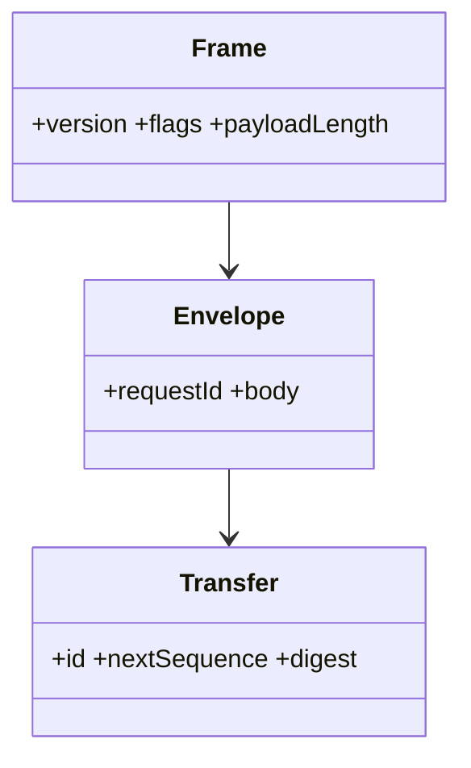

# 同步协议规范

## Purpose

定义现有 v1 的真实线协议、其限制和建议的 v2 二进制信封，供所有客户端和服务端实现互操作。

## Background

v1 是 TCP 或 TLS 上的 UTF-8 JSON Lines：每个对象以 `\n` 结束。已实现 `auth`、`auth_response`、`clipboard_text`、`file_bundle`、`file_transfer_start`、`file_transfer_chunk`、`file_transfer_complete`、`ping`、`pong` 和 `error`。文件包内容及分块 `data` 为 Base64；总文件不超过 4 MiB 时走 bundle，超过则按 512 KiB 分块。服务端转发 chunk 时未验证 `seq`，接收端也未按序重排，因此 v1 仅在单 TCP 流顺序下成立。

## Design Goals

- v2 提供明确长度、版本、消息身份、完整性和错误语义。
- 支持压缩、分片、恢复、流控和协议协商，而不把 Base64 当作二进制传输层。
- 允许 v1 只读兼容窗口并可观测地退役。

## Architecture

v2 运行于 TLS 1.3 WebSocket 或 HTTP/2 双向流；编码采用 Protobuf。每帧有固定头，负载可压缩并可选择端到端加密。控制帧与数据帧独立限额，避免大文件阻塞心跳。

## Detailed Design

帧布局：`magic(4) | version(1) | flags(1) | header_length(2) | payload_length(4) | header | payload`，网络字节序；`payload_length` 默认最大 1 MiB。header 含 `request_id`、`event_id`、`workspace_id`、`device_id`、`sequence`、`ack_sequence`、`content_sha256`。握手协商协议版本、压缩算法与最大帧。文件传输定义 `TransferBegin`、顺序编号 `Chunk`、可重传 `ChunkAck` 和 `TransferCommit`；接收方只在累计大小与 SHA-256 均匹配后提交临时文件。超时为握手 10 s、空闲心跳 15 s、三次未确认后指数退避，最大 60 s 并加入随机抖动。

```protobuf
message Envelope { uint32 version = 1; string request_id = 2; oneof body {
  ClipboardEvent publish = 10; Delivery delivery = 11; Ack ack = 12; Error error = 13;
}}
message ClipboardEvent { string event_id = 1; string workspace_id = 2; uint64 sequence = 3;
  string mime_type = 4; bytes content = 5; bytes sha256 = 6; }
```

错误码：`UNAUTHENTICATED`、`PERMISSION_DENIED`、`UNSUPPORTED_VERSION`、`FRAME_TOO_LARGE`、`INVALID_SEQUENCE`、`CHECKSUM_MISMATCH`、`QUOTA_EXCEEDED`、`RATE_LIMITED`、`TRANSFER_EXPIRED`、`INTERNAL`。任何失败均带 `request_id`，不得回显敏感负载。

## Sequence Diagrams



## Flow Charts



## UML when appropriate



## Future Extension

预留 `capabilities` 位图以支持富文本、图片、流式附件和端到端密文；新增字段必须可忽略，删除字段只允许在主版本升级时发生。

## Risks

双协议期间实现差异会形成降级漏洞；压缩可能造成解压炸弹；错误的长度检查会造成内存耗尽。

## Trade-offs

Protobuf 牺牲直接抓包可读性，却获得确定边界、紧凑编码和演进机制。JSON Lines v1 保留给迁移工具，不再扩展。
