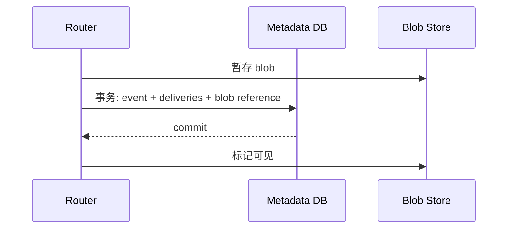
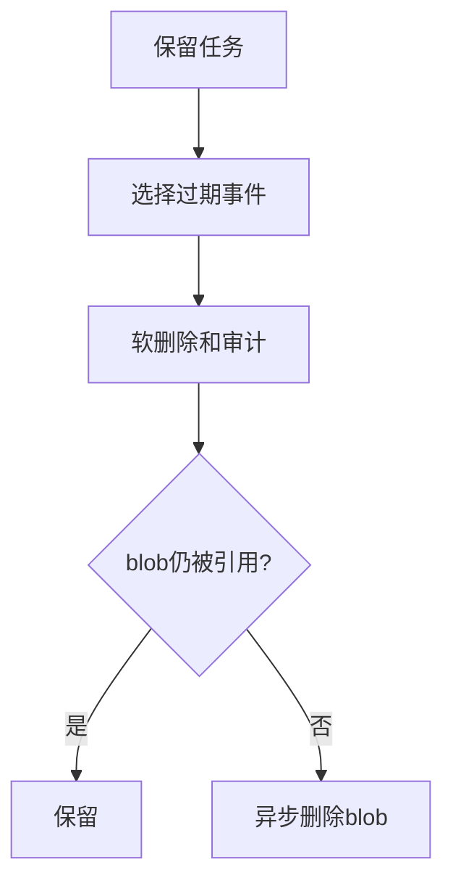
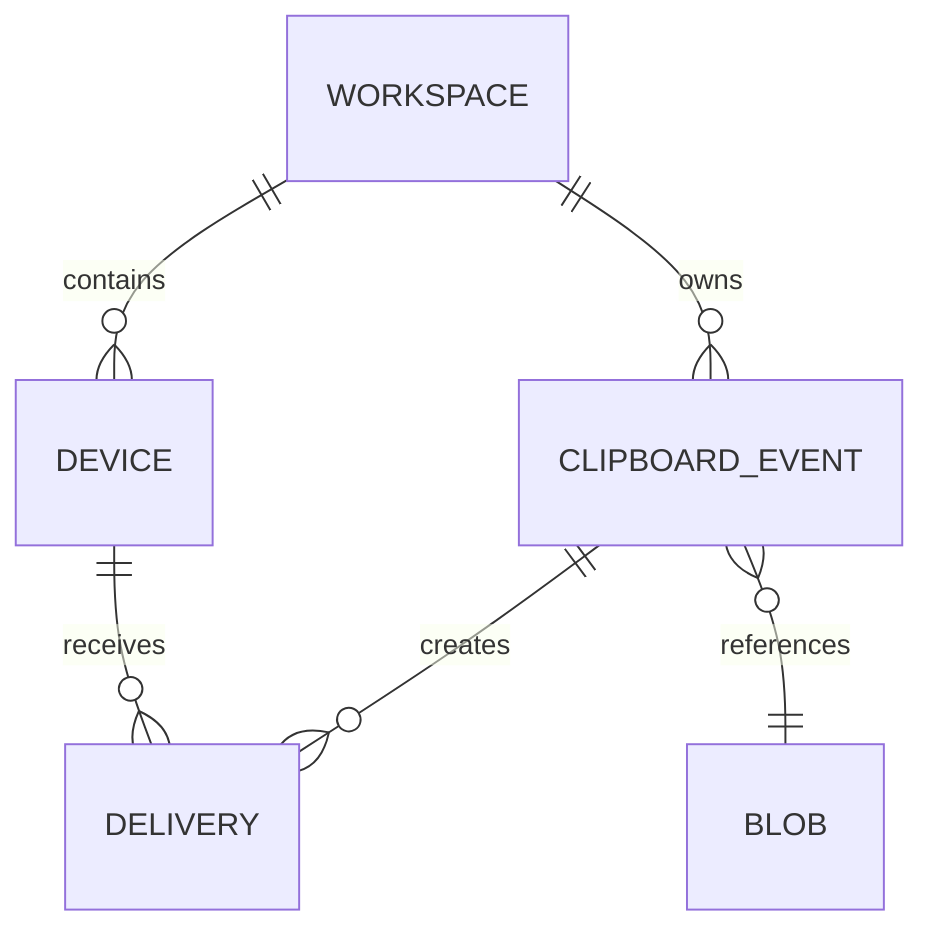

# 数据与存储设计

## Purpose

定义 SQLite 起步、PostgreSQL 扩展的逻辑数据模型，以及事件、文件、审计和保留策略的生命周期。

## Background

当前服务端仅将收到文件写入按时间与用户名命名的目录，按最后修改时间删除；文本和会话不持久化。没有数据库、迁移、索引、备份或历史删除审计。

## Design Goals

- 以事件元数据支撑可靠投递、幂等、审计和撤销。
- 让内容 blob 与关系数据解耦，避免数据库承载大文件。
- 可从单节点 SQLite 平滑迁移到 PostgreSQL。

## Architecture

存储接口分为事务性元数据仓库和对象存储。SQLite 使用 WAL、单进程写入队列；PostgreSQL 使用连接池、分区表和行级工作区隔离。blob 以内容摘要寻址，只有提交事件的事务完成后才可被引用。

## Detailed Design

核心表：`organizations`、`workspaces`、`users`、`devices`、`device_keys`、`clipboard_events`、`deliveries`、`blobs`、`audit_log`、`schema_migrations`。`clipboard_events` 唯一键为 `(workspace_id,event_id)`，`deliveries` 唯一键为 `(event_id,device_id)`，消除重发重复。索引：事件按 `(workspace_id,created_at desc)`；待投递按 `(device_id,status,next_attempt_at)`；审计按 `(organization_id,occurred_at desc)`。保留任务先标记过期事件，再在无引用时异步删除 blob；法律保留可冻结工作区。备份采取每日加密逻辑备份、blob 清单校验、季度恢复演练。

## Sequence Diagrams

## Flow Charts

## UML when appropriate

## Future Extension

新增全文检索只能建立在用户显式启用、密钥策略允许的明文元数据上；端到端加密内容只索引不可逆大小和时间等最小信息。

## Risks

SQLite 的网络文件系统锁语义不可靠；对象和元数据两阶段提交会遗留孤儿对象；保留清理误配置不可逆。

## Trade-offs

本地 SQLite 降低部署门槛，但限制高并发写入；PostgreSQL 增加运维成本，换取多副本、备份工具和可扩展查询。
