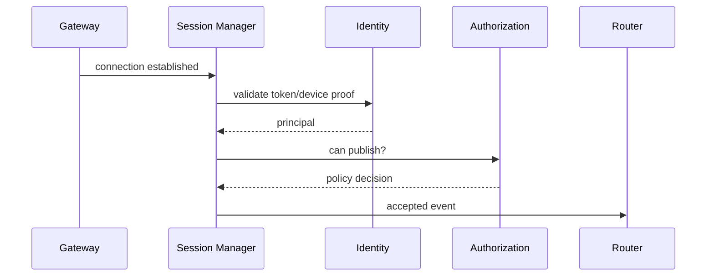
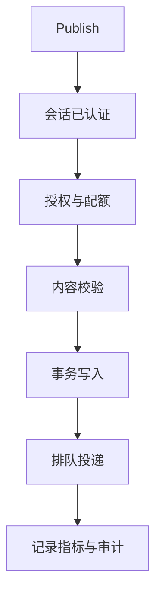
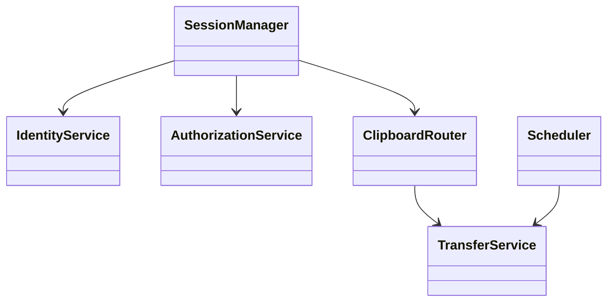

# 服务端设计

## Purpose

规定服务端会话、身份、路由、文件、调度、配置和可观测性职责，避免将它们继续堆入 `TcpServer`。

## Background

`server_common/TcpServer` 同时承担监听、TLS、明文凭据比较、会话表、JSON 解析、广播、文件落盘和清理。它接受任意 IPv4 连接，认证成功后向所有其他认证连接转发消息；凭据与配置文件均可明文保存。

## Design Goals

- 将控制职责拆分为可测服务并以稳定接口组合。
- 为每个资源建立配额、超时和结构化审计。
- 在不降低小部署可用性的前提下支持多工作区和水平扩展。

## Architecture

服务端模块为 Gateway、SessionManager、IdentityService、AuthorizationService、ClipboardRouter、TransferService、Storage、Scheduler、PluginHost、Observability。SessionManager 维护连接生命周期；Identity 颁发主体；Authorization 在每个 publish/deliver 决策；ClipboardRouter 不理解 socket 细节；TransferService 管理临时分块与提交。

## Detailed Design

会话状态为 `Connected → Negotiated → Authenticated → Draining → Closed`；认证失败在固定时间内关闭且不暴露账户存在性。worker pool 大小按 CPU 核配置，I/O 队列、每会话发送队列和每工作区上传量均有上限。调度器处理令牌轮换、过期传输、保留和重投；不得在连接线程执行递归目录扫描。配置由版本化 YAML/环境变量加载，密钥只经 secret provider 引用。日志为 JSON，包含 correlation id、workspace、device、事件结果；指标包括连接数、认证失败、投递延迟、队列深度、传输字节和清理失败。

## Sequence Diagrams

## Flow Charts

## UML when appropriate

## Future Extension

服务发现可通过注册中心发布健康端点；跨节点路由通过共享事件仓库或消息总线实现，连接仍可粘性负载均衡。

## Risks

插件或扫描器若在同步关键路径运行会拖慢全部用户；多节点时未共享设备游标会造成重复或丢失投递。

## Trade-offs

结构化服务增加模块数量，但使凭据校验、落盘和广播不再相互耦合。先采用单进程模块化部署，达到负载阈值再外置队列与存储。
