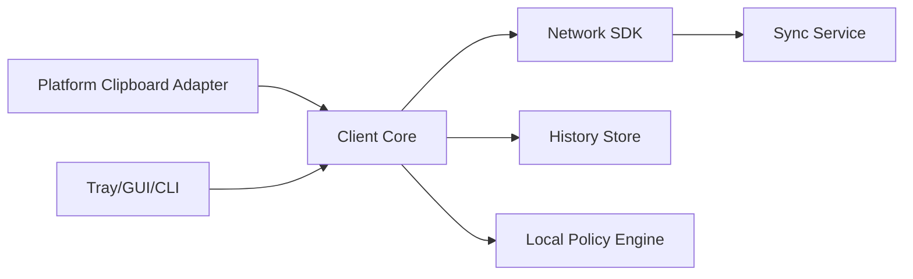
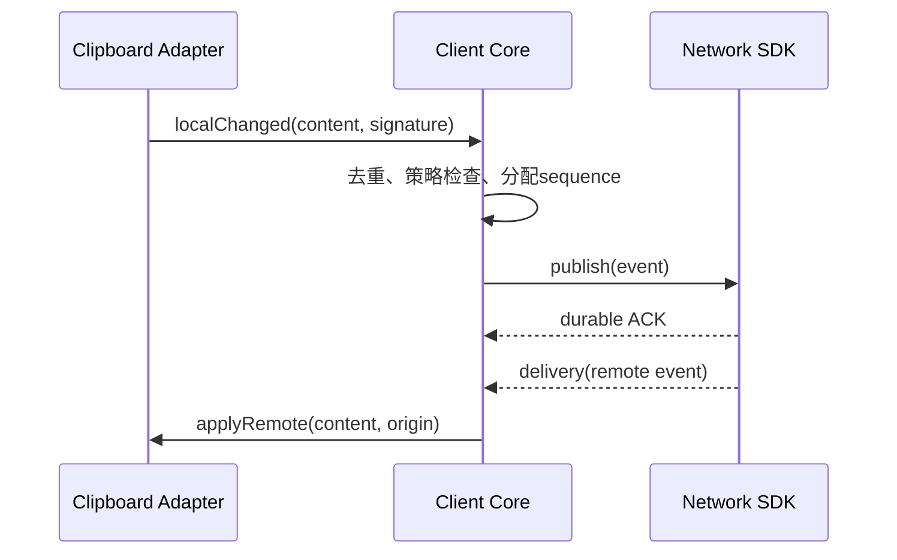
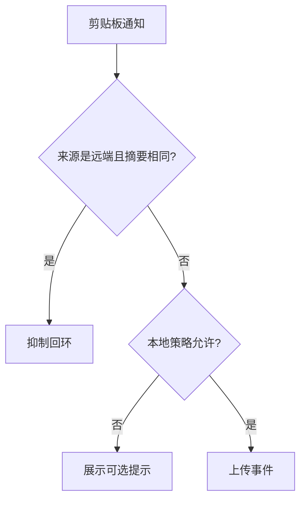
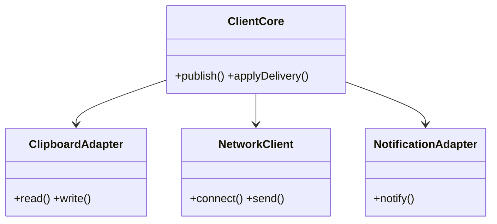

# 客户端与平台适配设计

## Purpose

定义各客户端共享行为及 Windows、Wayland/Linux、CLI 的平台边界，确保协议和安全策略一致。

## Background

Windows GUI 用 Qt `QClipboard` 轮询；Wayland GUI 通过 `wl-paste`/`wl-copy` 每 500 ms 调用外部命令；Linux CLI 同样轮询 `wl-paste`。GUI 使用 `QSslSocket`、10 s 心跳、30 s 超时与上限 30 s 退避；CLI 使用 POSIX socket 并实现相同数值。Windows 额外注册原生全局热键；Wayland 只能提供窗口内快捷键。GUI 和 CLI 都能保存接收文件并校验 SHA-256。

## Design Goals

- 共享 Client Core、协议 SDK、同步状态机和文件接收器。
- 将剪贴板、通知、托盘、热键、设置与自启动隔离为平台适配器。
- 避免远端内容再次被本地观察器回传。

## Architecture

## Detailed Design

Client Core 维护 `Disconnected → Connecting → Authenticating → Ready → Backoff → Stopped` 状态。每个本地变更生成含 device id、单调 sequence 和内容摘要的事件；应用远端事件时写入短期来源标记，适配器观察到同一摘要必须抑制。文件先写入工作目录，校验大小、顺序和摘要后原子移动至接收目录。Windows 适配器监听系统剪贴板变更事件替代轮询；Wayland 采用 portal/数据控制协议，`wl-clipboard` 仅为兼容回退。通知不得展示敏感正文；历史默认关闭且独立加密。

## Sequence Diagrams

## Flow Charts

## UML when appropriate

## Future Extension

macOS 用 NSPasteboard，移动端通过显式分享/通知而不是后台读取系统剪贴板；桌面端可增加多个工作区和按应用排除规则。

## Risks

Wayland 的安全模型限制全局剪贴板访问；不同平台 MIME 类型和文件 URL 表示不一致；错误的来源抑制会造成回环或丢失真实编辑。

## Trade-offs

事件驱动适配器比轮询复杂，却显著降低唤醒和延迟；不保证在受限桌面环境中无感同步，优先服从平台安全策略。
