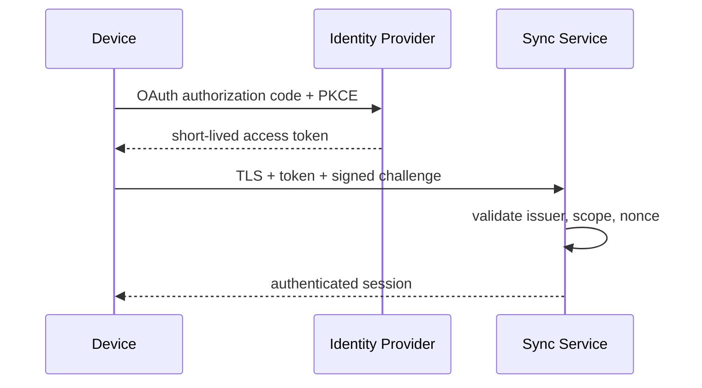
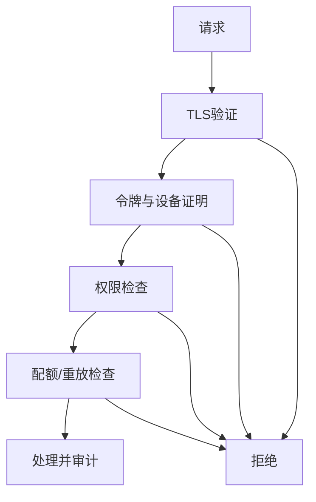
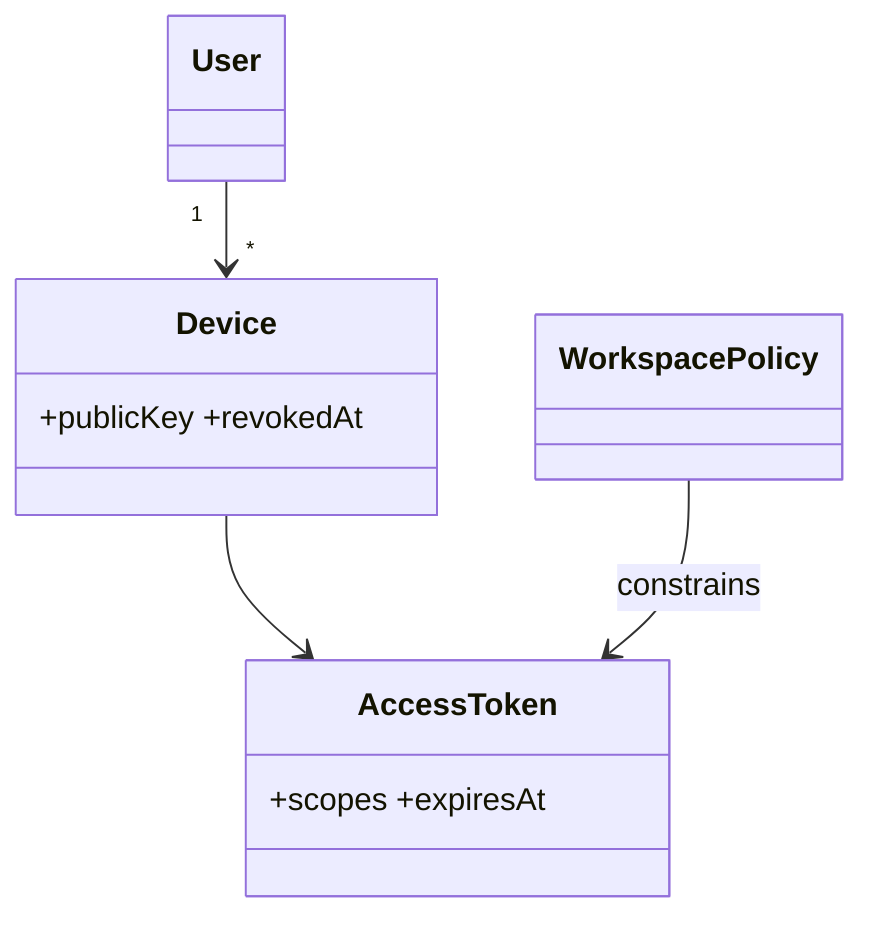

# 安全架构与威胁模型

## Purpose

建立生产环境必须遵守的加密、身份、授权、密钥和滥用防护要求，并记录当前实现的安全差距。

## Background

现状 TLS 可选且 GUI/CLI 默认允许不安全证书；认证是传输中的 username/password 字符串比较，默认值为 `admin/admin`；客户端和服务端 JSON 配置明文保存密码。服务端无速率限制、设备身份、授权或重放防护。

## Design Goals

- 生产环境默认安全：TLS 1.3、可信证书、最小权限和密钥轮换。
- 将用户、设备、工作区和操作分离授权。
- 为高敏感工作区提供端到端内容加密，同时保留可运维的元数据。

## Architecture

OAuth 2.1/OIDC 提供用户登录，授权服务器签发短期 JWT（受众、工作区、设备、scope、过期时间）。设备注册生成 Ed25519 密钥对并由用户确认；每次会话对挑战签名。服务器端密码仅允许 Argon2id 哈希作为本地 bootstrap 回退。可选 E2EE 用 X25519 建立工作区密钥包，内容使用 XChaCha20-Poly1305；服务器只处理密文、摘要和路由元数据。

## Detailed Design

TLS 禁止 `allow_insecure_tls` 用于生产，证书固定或系统信任链验证，支持 mTLS 作为受管设备选项。每个 publish 含唯一 event id、设备单调计数和签名/令牌绑定；服务器保存接收窗口以拒绝重放。令牌桶按 IP、账户、设备和工作区限流；认证失败逐步退避并发送安全审计。权限为 `workspace:read`、`workspace:publish`、`device:manage`、`history:read`、`plugin:install`，默认不授予历史读取。上传做 MIME、大小、存储配额和恶意内容扫描；日志清洗令牌、密码和正文。

## Sequence Diagrams

## Flow Charts

## UML when appropriate

## Future Extension

接入企业 SCIM、硬件密钥证明、密钥透明日志和 DLP 分类器；每项均须通过隐私评估并允许工作区关闭。

## Risks

端到端加密会削弱服务端恶意文件扫描和内容搜索；证书固定的运维失误可能导致大面积不可连接；设备私钥丢失需要可审计恢复流程。

## Trade-offs

默认严格证书验证牺牲自签名快速上手，却消除中间人风险。将可选 E2EE 设计为工作区策略，避免强制它阻塞基础可观测性和恢复。
