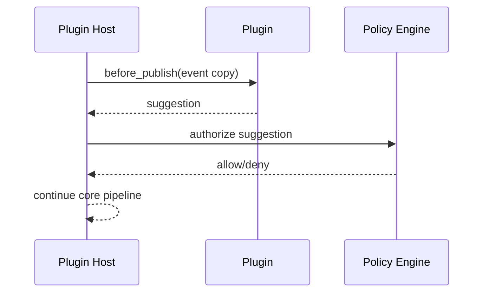
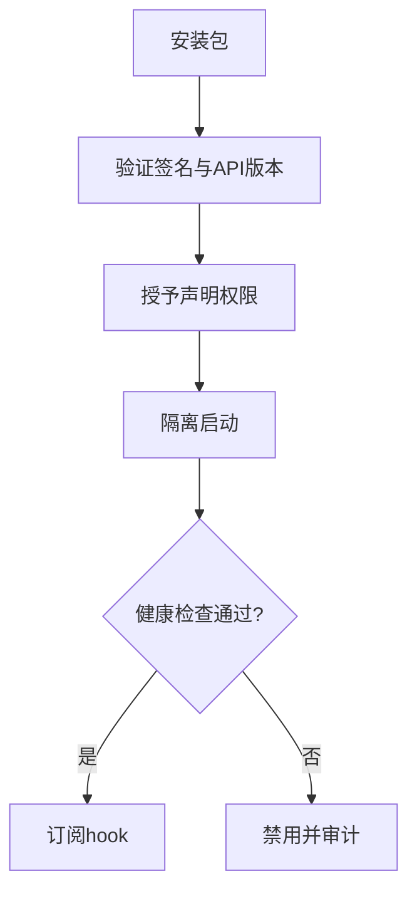
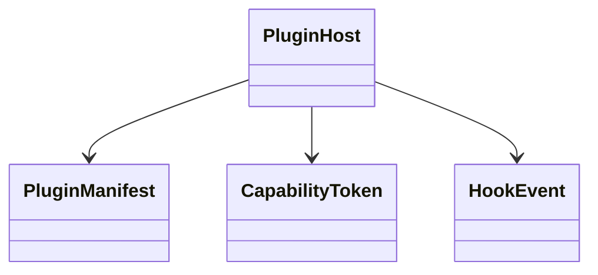

# 插件 SDK 设计

## Purpose

定义可版本化、最小权限、可隔离的插件机制，避免第三方代码直接嵌入同步和加密关键路径。

## Background

当前仓库没有插件加载器、SDK、权限或市场协议。任何“插件功能”都必须作为目标设计，不得宣称已实现。

## Design Goals

- 提供转换、通知、策略、审计导出等扩展点。
- 使插件崩溃、超时或恶意行为不影响协议正确性。
- 支持签名、兼容性检查和未来市场分发。

## Architecture

插件以 manifest、签名、WASM 或受限子进程组成。Plugin Host 通过事件总线投递不可变事件副本，暴露经 capability token 授权的 SDK；网络、文件系统和密钥访问默认拒绝。核心只接受插件产生的“建议动作”，再由 Policy Engine 重新授权。

## Detailed Design

manifest 包含 `id`、`version`、`api_version`、入口点、声明权限、资源限制和签名者。生命周期为 `install → validate → start → ready → stop → uninstall`；hook 包括 `before_publish`、`after_delivery`、`notify`、`audit_sink`、`policy_hint`。`before_publish` 只能拒绝或变换副本，不能读取未声明 MIME；每 hook 有 100 ms CPU 预算与 4 MiB 消息上限。SDK 采用语义化版本，破坏性变更通过新 capability 发布；市场索引和包签名可离线缓存。

## Sequence Diagrams

## Flow Charts

## UML when appropriate

## Future Extension

支持远程插件市场、组织私有源、计费和可复现构建证明；市场运营不应绕过本地审批策略。

## Risks

插件能看到剪贴板内容即构成高敏数据处理风险；WASM 运行时和子进程隔离都可能存在逃逸漏洞。

## Trade-offs

受限能力模型比进程内 C++ API 更少自由度，但允许稳定升级并显著缩小供应链和崩溃半径。
