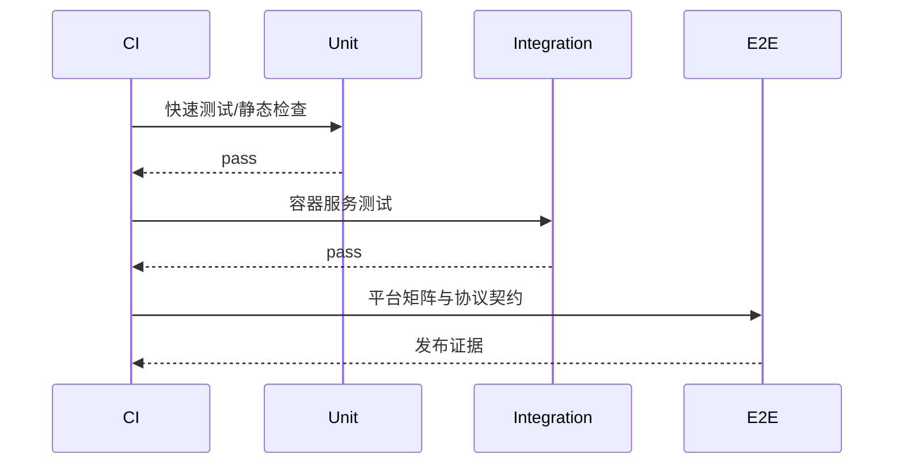
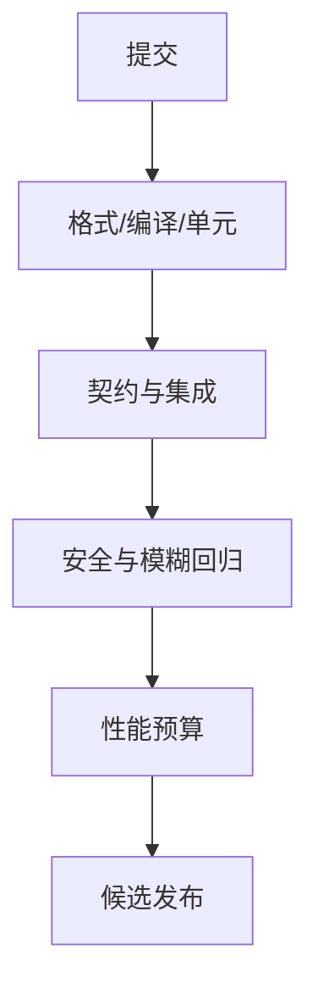
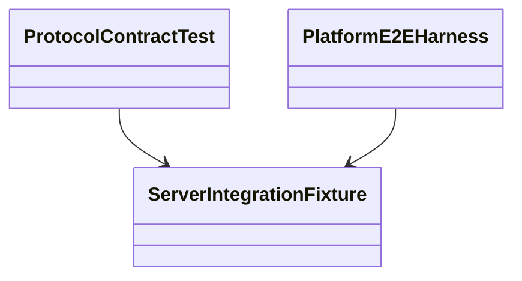

# 测试与质量策略

## Purpose

定义从单元到混沌测试的验证层级、覆盖目标和发布门禁，使协议与安全行为可重复验证。

## Background

当前仓库未提供测试目标、CI 工作流或覆盖率配置。构建目录中有本机生成物，不应被当作验证证据或版本控制输入。

## Design Goals

- 让协议兼容、安全拒绝和文件完整性成为自动化回归项。
- 在无 GUI 桌面环境也能测试客户端核心。
- 通过性能、模糊和故障注入发现资源耗尽问题。

## Architecture

测试金字塔以纯函数和存储接口单元测试为底，容器化服务集成测试居中，真实平台端到端测试居上。契约测试从同一 v2 schema 生成客户端与服务端案例；测试夹具提供临时工作区、证书和对象存储。

## Detailed Design

单元测试覆盖 Base64/摘要、路径净化、帧解析、重传状态机、策略判定和迁移。集成测试覆盖 TLS、认证、授权、事务 outbox、文件断点恢复、保留清理和 PostgreSQL/SQLite 一致性。E2E 覆盖 Windows 与 Wayland/CLI 的文本、文件、断线重连和回环抑制。压力测试衡量 1k 连接、慢消费者、超大分块并发；基准记录 P50/P95/P99 延迟、CPU、内存和磁盘。libFuzzer/AFL 处理帧解析、Protobuf、压缩和 URI 路径；安全扫描含依赖、密钥和 SAST。核心覆盖率门槛：行 80%、分支 70%，安全和协议模块分支 90%。

## Sequence Diagrams

## Flow Charts

## UML when appropriate

## Future Extension

添加网络模拟器、生产流量匿名回放和持续性能趋势报警；所有新协议字段必须带有旧客户端行为测试。

## Risks

只在 Linux 构建会掩盖 Windows 行为差异；不稳定桌面 E2E 容易被忽略；覆盖率可能被低价值测试虚高。

## Trade-offs

将昂贵 E2E 放在合并队列/夜间运行可缩短反馈时间，但发布前仍必须执行；性能预算允许小幅回归以避免阻碍必要安全修复。
