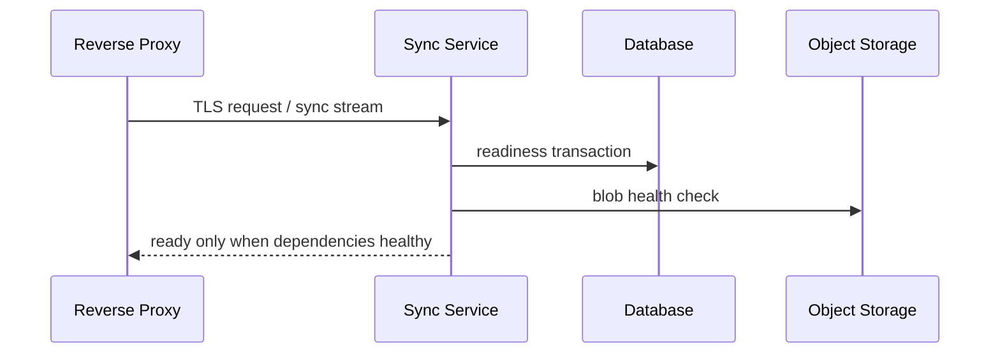
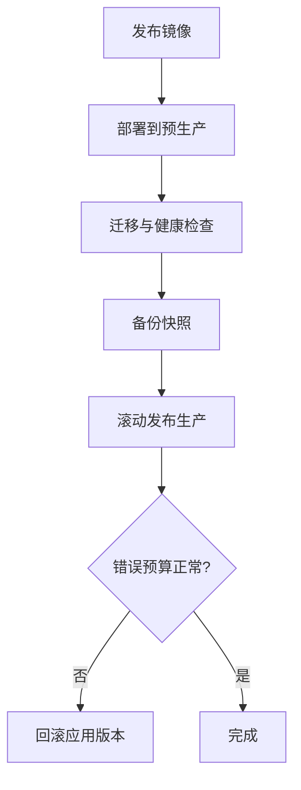
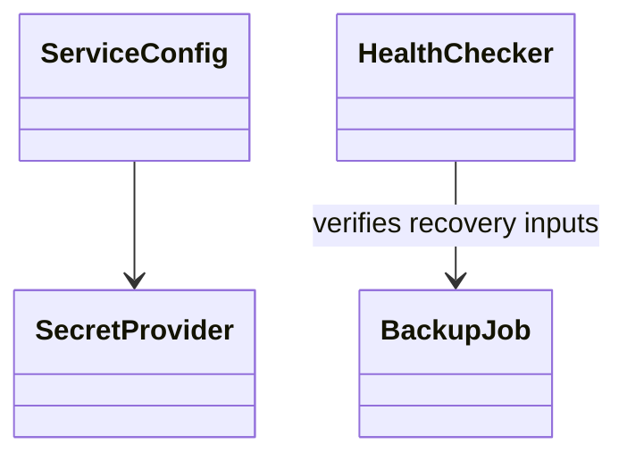

# 部署与运行设计

## Purpose

规定开发、单节点生产和扩展部署方式、配置来源、备份恢复及运行健康标准。

## Background

当前 Linux 安装脚本按发行版安装 CMake、Qt、OpenSSL、nlohmann-json 和 `wl-clipboard`，再把四个二进制复制到 `/usr/local/bin`。没有容器、服务单元、反向代理、健康检查或备份编排。Windows CMake 和部署脚本硬编码本机 Qt 路径。

## Design Goals

- 让生产部署可重复、无交互、最小权限且可恢复。
- 将配置与秘密分离，避免命令行和 JSON 明文密码。
- 支持从单节点到多节点的清晰升级路径。

## Architecture

Docker 镜像只包含服务端与非 root 运行用户；Docker Compose 提供服务、PostgreSQL、对象存储和反向代理。生产入口使用 TLS 终止或端到端 TLS passthrough，健康端点区分 liveness、readiness 和依赖状态。Windows 以受限服务账户运行，Linux 使用 systemd sandbox。

## Detailed Design

配置优先级为环境变量、挂载的版本化配置、默认值；秘密由文件权限 0600、Docker secret 或密钥管理器注入。systemd 指定 `NoNewPrivileges=yes`、`ProtectSystem=strict`、`PrivateTmp=yes`、可写入 data 目录和资源上限。反向代理仅接受 TLS 1.3、设置请求体上限、连接速率和访问日志脱敏。备份包括元数据加密导出、blob 清单、密钥恢复材料与恢复演练；RPO 24 h、单节点 RTO 4 h，团队部署按业务要求收紧。

## Sequence Diagrams

## Flow Charts

## UML when appropriate

## Future Extension

支持 Kubernetes、地域灾备和跨区域对象复制时，必须先验证工作区数据驻留要求与 E2EE 密钥恢复流程。

## Risks

反向代理 WebSocket/HTTP2 配置错误会造成隐性断线；数据库迁移不可逆会阻塞回滚；备份未恢复验证等同于没有备份。

## Trade-offs

容器化增加镜像维护，却消除宿主 Qt/编译器依赖；单节点 Compose 保持简单，多节点只在容量和可用性需要时启用。
