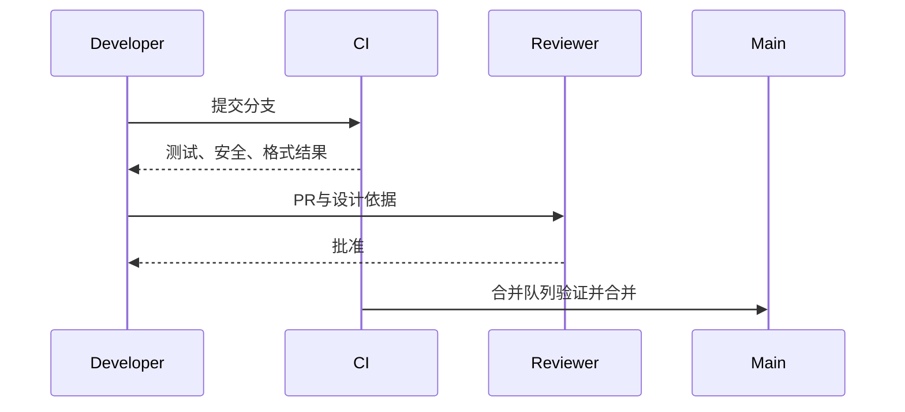
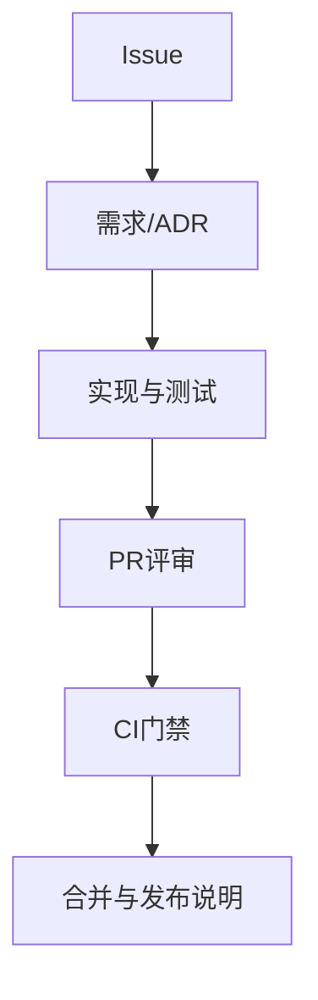
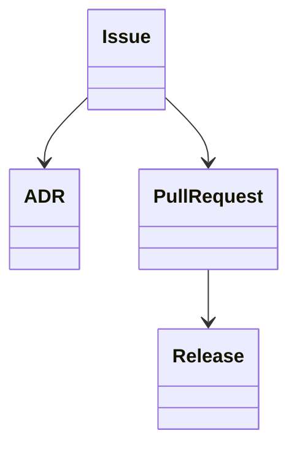

# 工程标准

## Purpose

定义仓库协作、编码、评审、分支和版本规范，使设计文档成为变更的约束而非事后说明。

## Background

当前仓库包含重复平台实现、遗留未构建源码、提交历史中不同行为混杂，且无 CI、贡献模板、许可证或标准化发布流程。

## Design Goals

- 每次变更可追踪到需求、ADR、测试与发布说明。
- 保护主线可构建、可审计、无已知秘密。
- 在 C++/Qt 与脚本之间保持一致的可读性和安全基线。

## Architecture

工程治理由 Git、CI、代码所有者、issue/PR 模板、ADR 和发布自动化组成。仓库应把可构建源、第三方锁定信息、测试和 `docs` 纳入版本控制；移除生成的 `build/` 目录与本机 `.user` 配置。

## Detailed Design

采用 trunk-based 开发：短命 `feature/<issue>-summary` 分支，经合并队列进入 `main`；紧急修复使用 `hotfix/`。提交遵循 Conventional Commits，如 `feat(protocol): add transfer ack`，禁止把格式化与逻辑重构混在一起。C++17 使用 RAII、值语义、明确所有权、`std::chrono` 和无异常跨线程边界；禁止裸密钥、默认凭据和未限制外部输入。PR 必须说明需求/ADR、风险、迁移、测试和安全影响，两名评审或代码所有者一名批准。版本使用 SemVer，协议兼容性单独记录；release 分支只接收修复和文档。

## Sequence Diagrams

## Flow Charts

## UML when appropriate

## Future Extension

引入代码所有者、自动依赖更新、SBOM、签名提交和受保护发布工件；选择许可证前完成第三方依赖许可证审查。

## Risks

过度流程会拖慢小修复；缺少门禁则会继续积累不兼容平台分支和安全债务。

## Trade-offs

短分支降低合并冲突但要求频繁同步主线；强制 PR 模板增加填写成本，换取可追溯的安全与迁移决策。
