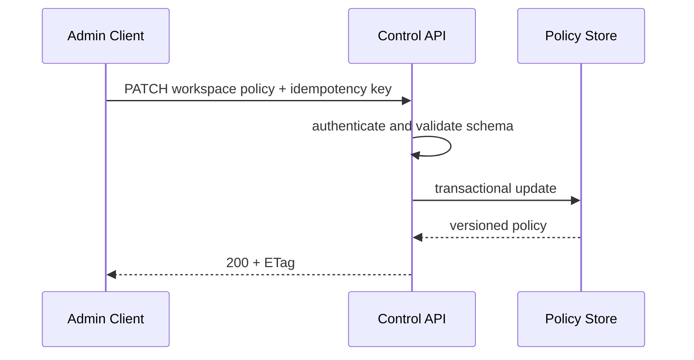
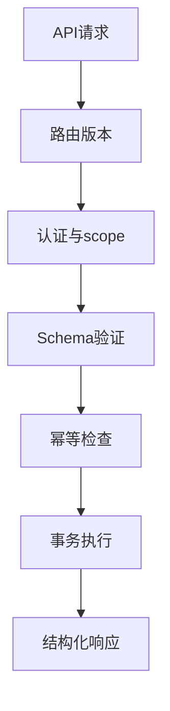
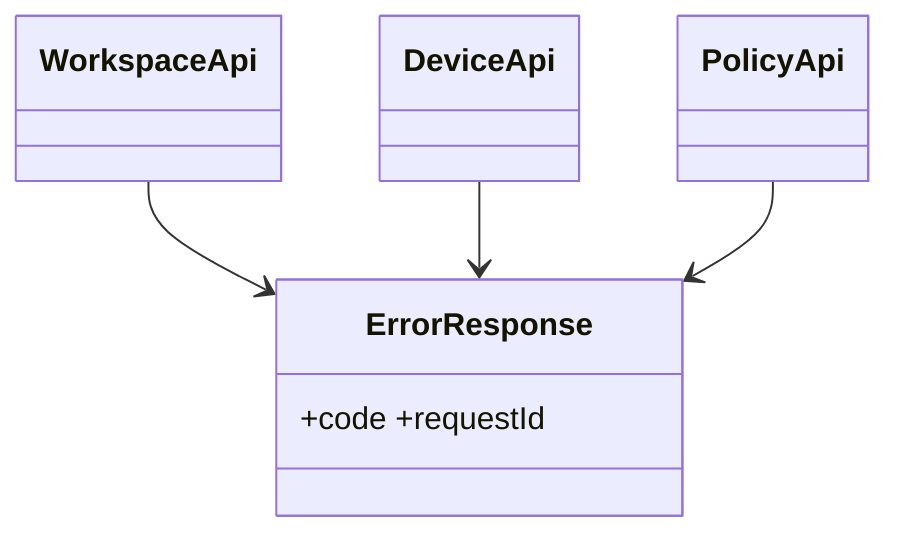

# API 与配置契约

## Purpose

定义控制面 API、配置模型和 v1 兼容边界；实时同步帧详见协议规范。

## Background

现有接口只有私有 TCP JSON Lines。CLI 配置位于 XDG `RemoteClipboard/linux-cli/config.json`；服务端按 `server-64mb` 或 `server-512mb` 命名空间保存 JSON；GUI 使用 Qt AppConfigLocation。所有模型都可能保存明文 username/password。

## Design Goals

- 让工作区、设备、策略和历史管理可通过版本化 HTTPS API 操作。
- 使用显式 schema、错误模型、分页和幂等键。
- 保证配置迁移可检测、可回滚且不再保存秘密。

## Architecture

控制面采用 `/api/v1` JSON HTTPS，实时面使用 v2 协议流。OpenAPI 是控制面唯一契约；Protobuf 是实时面唯一契约。配置由 `ClientConfig`/`ServerConfig` schema 版本驱动，秘密字段仅保存 secret reference。

## Detailed Design

端点：`POST /sessions`、`GET/POST /workspaces`、`GET/POST /workspaces/{id}/devices`、`PATCH /devices/{id}`、`GET/PATCH /workspaces/{id}/policy`、`GET /events`、`POST /plugins`。写操作必须包含 `Idempotency-Key`；列表使用不透明 cursor；错误格式为 `{code,message,request_id,details}`。`GET /health/live` 不依赖外部服务，`GET /health/ready` 检查数据库、对象存储和密钥提供者。配置迁移读取旧版、验证、写入原子临时文件并保留备份；旧的 `allow_insecure_tls` 只能在开发 profile 出现。

## Sequence Diagrams

## Flow Charts

## UML when appropriate

## Future Extension

通过 `/api/v2` 引入破坏性资源模型；在一个主版本内只添加可选字段，借助 capability discovery 让旧客户端安全降级。

## Risks

控制面与实时面使用不同身份校验会产生权限绕过；配置原子写入失败可能丢失用户设置；开放历史 API 会扩大数据暴露面。

## Trade-offs

REST 控制面便于管理、审计和文档化，实时数据仍采用长连接以维持延迟和双向投递；二者共享身份声明而不共享传输格式。
