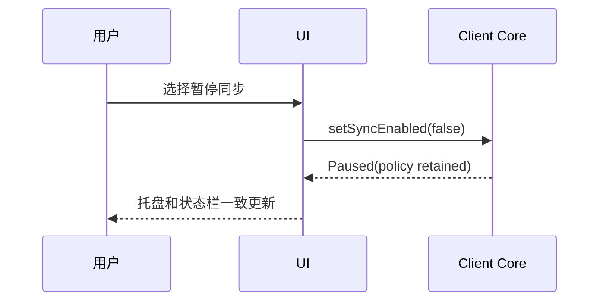
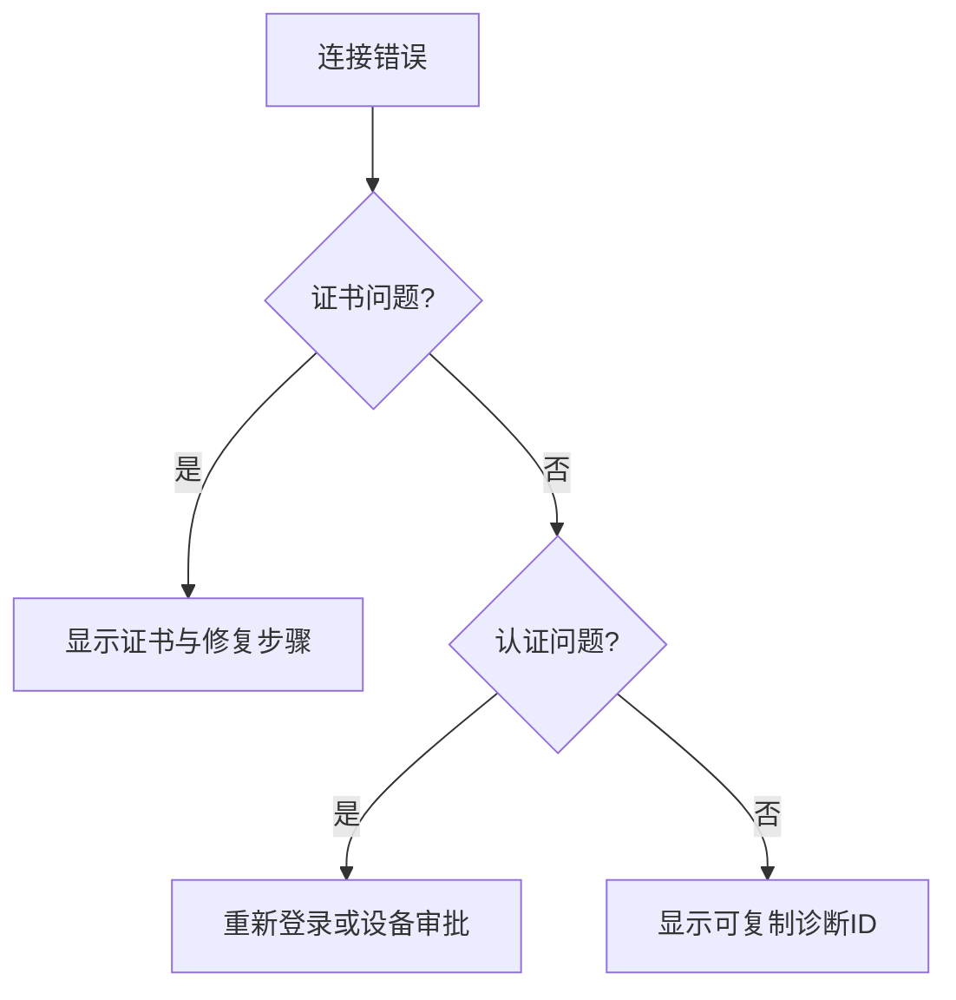
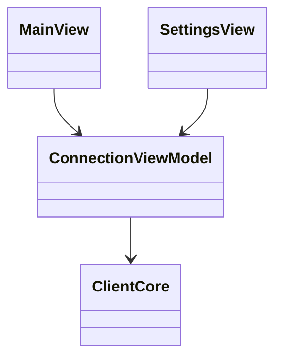

# UI 与交互设计

## Purpose

规范桌面 GUI、托盘、通知、设置、历史和热键的交互原则，确保安全状态和同步范围对用户清晰可见。

## Background

当前 GUI 提供连接表单、日志、配置 profile、接收目录、TLS 选项、自启动、托盘和快捷键。Windows 有原生全局热键；Wayland 因平台限制仅依赖窗口内快捷键/托盘。设置界面未暴露不安全证书开关，但 profile 默认允许不安全 TLS。

## Design Goals

- 用户在复制前后都能知道目标工作区、同步状态和数据处理范围。
- 将安全错误显示为可操作的阻断，而不是静默忽略。
- 兼容键盘、屏幕阅读器、高对比度和小屏幕。

## Architecture

UI 只订阅 Client Core 的状态和命令，不解析协议帧。ViewModel 公开连接、认证、队列、最后同步、策略和错误；平台服务提供托盘、通知、目录选择、自启动和热键。

## Detailed Design

主界面显示工作区选择器、连接状态灯、最近同步摘要和“暂停同步”开关；不展示远端敏感内容。首次连接走配对向导：服务器验证、登录、设备命名、工作区选择、权限说明。设置将网络、同步范围、文件规则、通知、历史、隐私和高级诊断分组。收到文件时通知只显示来源设备和文件数量；点击后打开受限的接收目录。TLS 失败提供证书详情与信任链修复指引，生产模式没有“继续忽略”按钮。

## Sequence Diagrams

## Flow Charts

## UML when appropriate

## Future Extension

加入设备管理、冲突历史、按应用暂停和移动端配对二维码；所有通知内容受工作区隐私策略约束。

## Risks

过度通知会让用户关闭关键提示；将复杂安全选项暴露给非专家可能诱导不安全选择；Wayland 不能承诺全局热键。

## Trade-offs

采用“安全失败即阻断”会增加故障时摩擦，却避免无意中信任伪造证书；将高级诊断放入单独页面保持主界面简洁。
