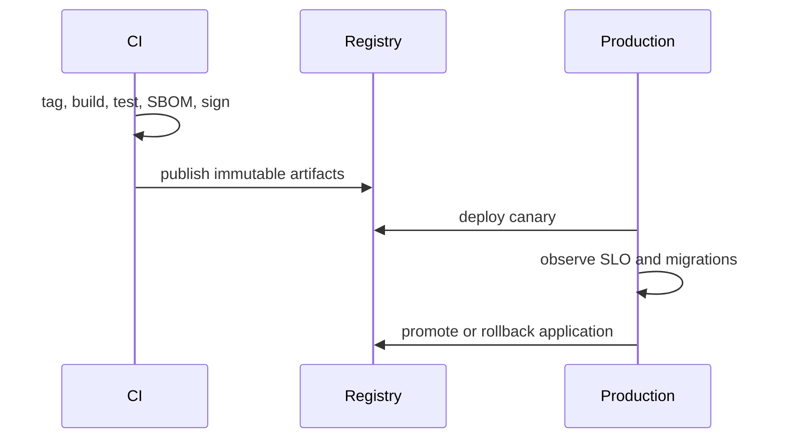
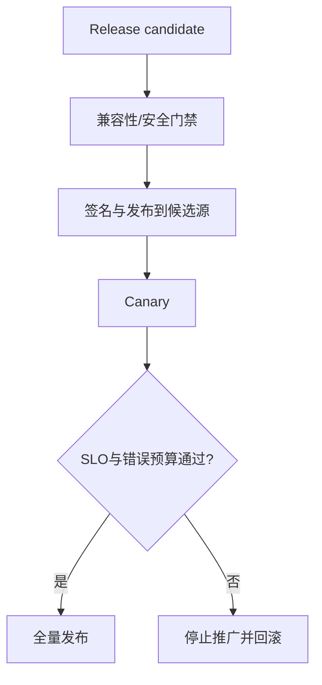
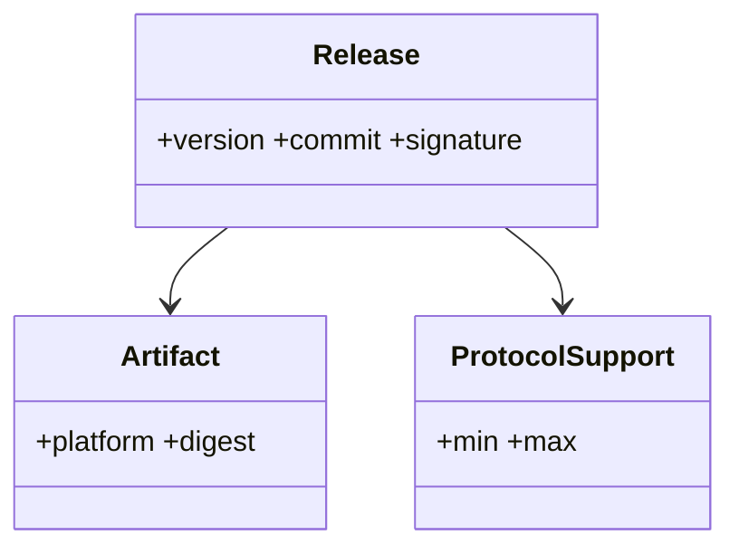

# 发布与兼容性管理

## Implementation Status

v0.1 已通过 `.github/workflows/release.yml` 实现 tag 驱动的 Debian 12 DEB、Fedora 42 RPM、Arch Linux 本地客户端包、Windows x64 客户端 ZIP 和统一源码 ZIP。每个平台在打包前完成构建与 CTest，聚合 job 生成 `SHA256SUMS`，tag 发布使用 GitHub OIDC 生成 Sigstore 构建证明。容器镜像、完整 SBOM、自动更新和许可证选择仍属于后续发布治理工作。

## Purpose

定义版本、构建工件、兼容窗口、升级和回滚规则，使多客户端与协议服务端能够有序演进。

## Background

项目当前无正式发布流程、变更日志、工件签名或 CI；构建名与产品名不一致（如 `RemotePostboard`、`dmo`），Windows 构建依赖硬编码 Qt 路径。

## Design Goals

- 每个可分发工件可追溯至源码、依赖、测试和签名。
- 协议与数据迁移有明确兼容矩阵和废弃日期。
- 发布失败可在不破坏用户数据的情况下回滚。

## Architecture

发布流水线从受保护 tag 生成 SBOM、可复现构建摘要、签名二进制、容器镜像、安装包和变更日志。服务端与客户端分别 SemVer；协议版本独立编号，并由 capability 协商而非产品版本猜测。

## Detailed Design

版本采用 `MAJOR.MINOR.PATCH`：MAJOR 移除 API/协议能力，MINOR 新增兼容能力，PATCH 仅修复。发布前冻结依赖锁、运行全矩阵测试、安全扫描和升级演练。服务端先支持 N 与 N-1 协议，客户端再逐步升级，最后在公告期后关闭旧协议；不可逆数据库迁移需 expand-contract 两阶段。工件至少包括 Linux x86_64、Windows x64、容器和校验和，使用 Sigstore 或组织签名密钥。回滚仅回滚应用；schema 保持前后兼容直到清理阶段。

## Sequence Diagrams

## Flow Charts

## UML when appropriate

## Future Extension

添加自动更新通道（stable/beta/nightly）、增量包和企业离线镜像；更新客户端必须验证签名并支持暂停。

## Risks

自动更新被供应链攻破会扩大影响；过早移除 v1 会留下离线设备；无清理期的迁移会令数据库永久背负兼容负担。

## Trade-offs

双协议支持增加测试矩阵，但给用户留出迁移时间；不可变工件提高存储成本，却提供可审计和可复现的发布证据。
