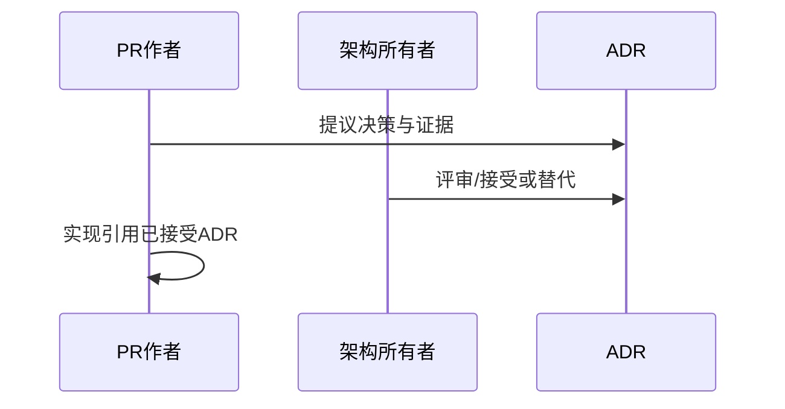
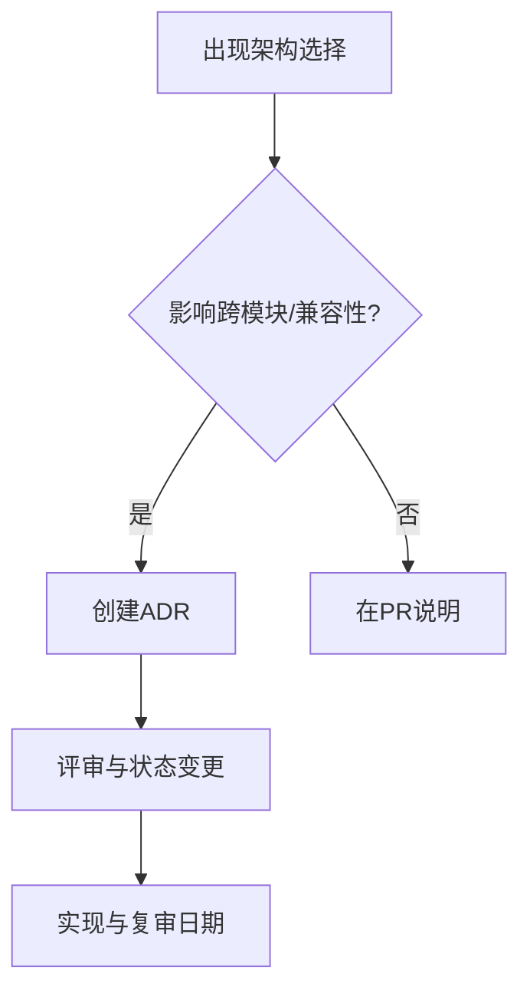
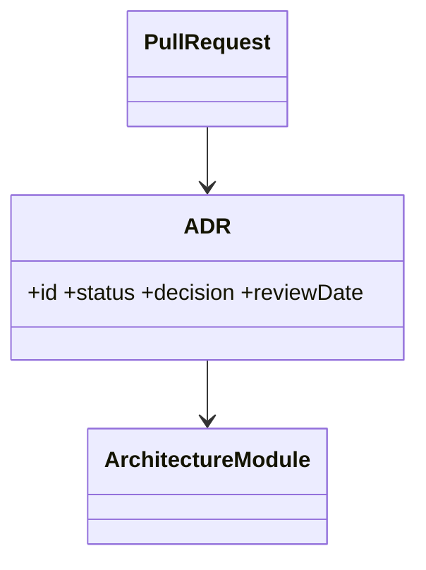

# 架构决策记录

## Purpose

记录关键技术选择、上下文、备选方案和复审条件；各 ADR 是约束实现的决策，而非历史叙述。

## Background

当前代码已选择 C++17、Qt、OpenSSL、nlohmann/json 和 JSON Lines，但未记录选择理由；同时存在不兼容历史服务器实现，容易让后续贡献者重复旧问题。

## Design Goals

- 让重大决策可追溯、可挑战、可在条件变化时替代。
- 区分“当前实现选择”和“目标架构选择”。
- 每个 ADR 有状态：Proposed、Accepted、Superseded 或 Deprecated。

## Architecture

ADR 位于此目录并由编号管理。实现 PR 必须引用影响它的 ADR；若与既有 ADR 冲突，先提交新的 ADR 将旧记录标为 Superseded。

## Detailed Design

### ADR-001：模块化单体优先（Accepted）
**Context：** 当前是单一 TCP 服务，尚无规模证据支撑微服务。**Alternatives：** 立即微服务、继续单类服务器。**Decision：** 采用模块化单体，边界为 Identity、Router、Storage、Plugin Host。**Pros：** 低部署成本、可独立测试。**Cons：** 进程内故障域仍共享。**Rationale：** 先解决耦合与持久化，再按指标拆分。

### ADR-002：Protobuf v2 与 JSON Lines v1 迁移（Accepted）
**Context：** v1 无长度、协商和可靠分块语义。**Alternatives：** 继续扩展 JSON、HTTP REST 轮询。**Decision：** v2 使用 Protobuf 信封，v1 只在受控兼容期支持。**Pros：** 帧边界、演进、性能。**Cons：** 调试复杂。**Rationale：** 同步协议需要明确二进制和版本约束。

### ADR-003：SQLite 起步、PostgreSQL 扩展（Accepted）
**Context：** 小部署需要零外部依赖，大部署需要并发和恢复能力。**Alternatives：** 仅文件系统、直接 PostgreSQL。**Decision：** 存储接口支持 SQLite WAL 与 PostgreSQL。**Pros：** 采用门槛低、迁移路径清晰。**Cons：** 双后端测试成本。**Rationale：** 当前文件目录不能提供可靠投递。

### ADR-004：生产环境强制 TLS 验证（Accepted）
**Context：** 现状默认允许不安全 TLS。**Alternatives：** 保持兼容、证书固定、系统信任链。**Decision：** TLS 1.3 + 信任链，开发环境可显式临时信任。**Pros：** 抵御中间人。**Cons：** 自签名部署更繁琐。**Rationale：** 剪贴板数据的敏感性不允许静默降级。

## Sequence Diagrams

## Flow Charts

## UML when appropriate

## Future Extension

为每个 ADR 加入 owner、度量指标和复审日期；安全相关 ADR 在威胁模型变化或重大漏洞后强制复审。

## Risks

ADR 若不随实现更新会变成过期权威；过多微小 ADR 会稀释重大决策的可见性。

## Trade-offs

记录决策消耗评审时间，却避免口口相传和无意回退；ADR 不替代详细设计，而是固定关键约束。
