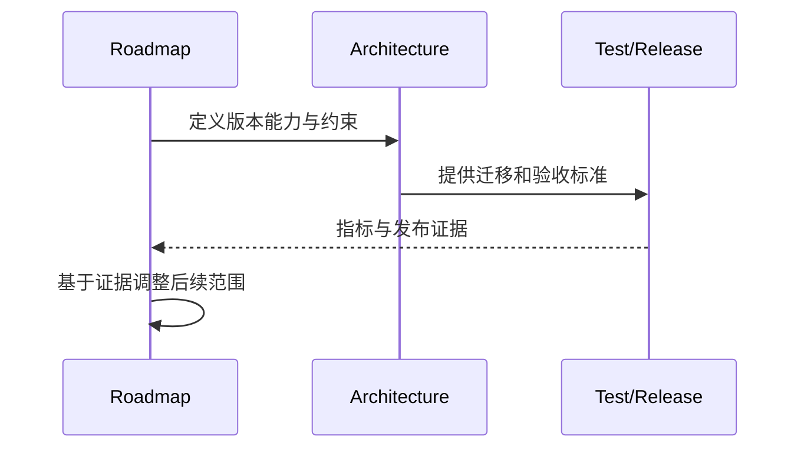
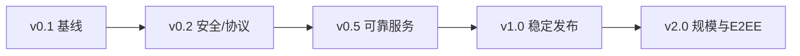
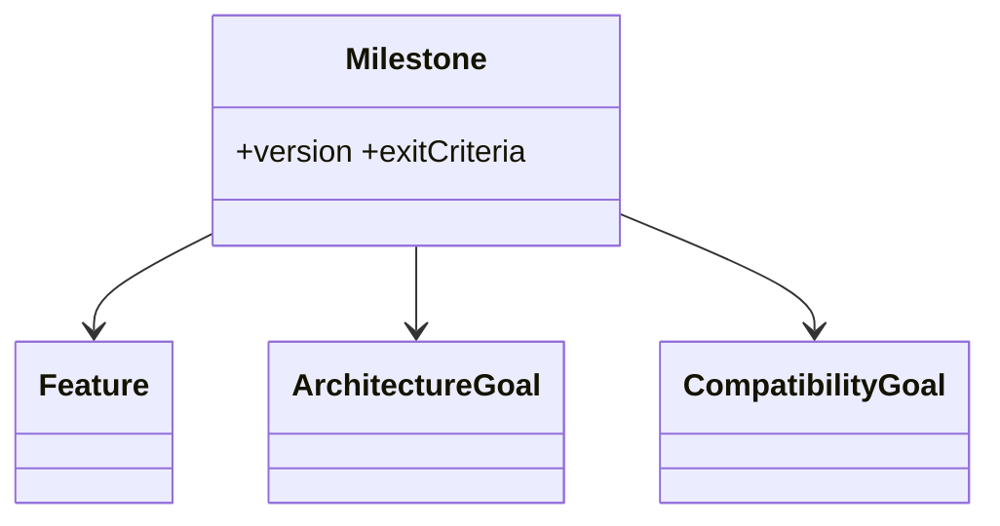

# 产品与技术路线图

## Purpose

按版本定义可交付能力、架构成果、性能目标和兼容承诺，作为投资与范围控制依据。

## Background

当前实现适合可信网络试验：有文本/文件传输、TLS 开关、心跳和重连，但没有生产身份、数据库、CI 或正式发布物。路线图从稳固现状开始，不承诺跳过安全和测试直接堆叠功能。

## Design Goals

- 每个里程碑同时交付功能、质量和迁移证据。
- 先收敛协议与共享核心，再扩展平台和生态。
- 不以“功能数量”替代安全、可靠性和可运维性。

## Architecture

v0.1 建立模块边界与测试；v0.2 建立安全身份与可靠事件；v0.5 完成存储、部署和插件基础；v1.0 承诺稳定契约；v2.0 引入大规模与端到端加密高级能力。

## Detailed Design

| 版本 | Features | Architecture Goals | Performance Goals | Compatibility Goals |
|---|---|---|---|---|
| v0.1 | 清理遗留构建文件、统一 Client Core、v1 契约测试 | 模块化单体骨架、CI、SQLite 原型 | 文本 P95 < 800 ms | 保持既有 v1 客户端可用 |
| v0.2 | 设备配对、TLS 严格验证、JWT、v2 协商 | Identity/Router/Storage 接口 | 100 并发连接稳定 | 服务端兼容 v1 与 v2 |
| v0.5 | 历史策略、PostgreSQL、Compose、文件恢复、插件宿主 | outbox、对象存储、可观测性 | 1k 在线连接，P95 < 500 ms | 数据迁移可回滚，v1 仅受控支持 |
| v1.0 | Windows/Linux 正式包、管理 API、审计、备份演练 | 稳定 SDK/API、发布签名 | 99.9% 单区域目标 | v2 契约稳定一个主版本 |
| v2.0 | 多节点、移动端、可选 E2EE、市场 | 可水平扩展路由与密钥包 | 10k 连接按部署规模线性扩展 | v1 结束支持，v2→v3 公告迁移 |

## Sequence Diagrams

## Flow Charts

## UML when appropriate

## Future Extension

每季度以错误预算、留存、设备数和客户反馈复审排序；路线图条目一旦承诺必须补充 owner、ADR 和量化退出标准。

## Risks

在 v0.2 前扩展富媒体或插件会放大不安全协议；过早承诺 v2.0 规模数字会造成错误投资；迁移期拖延会长期维护双栈。

## Trade-offs

路线图优先可靠性和安全会延迟表面功能，但形成可维护的发布基线；性能目标以场景和百分位表达，避免脱离部署条件的绝对承诺。
