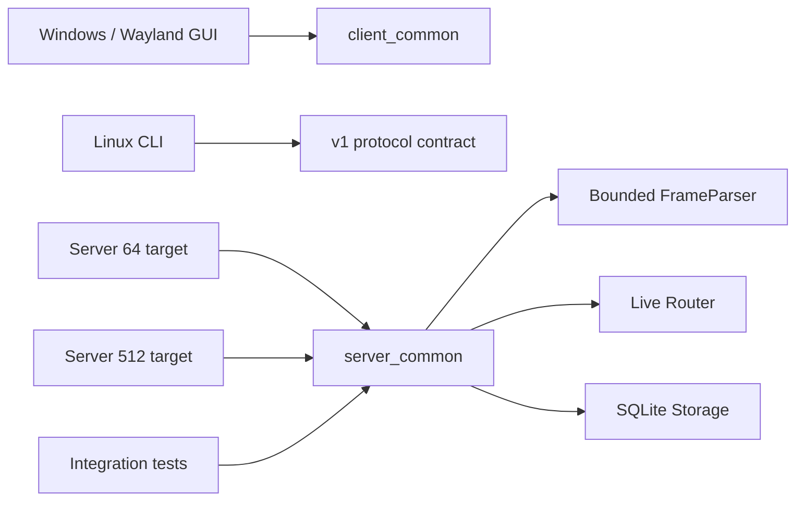
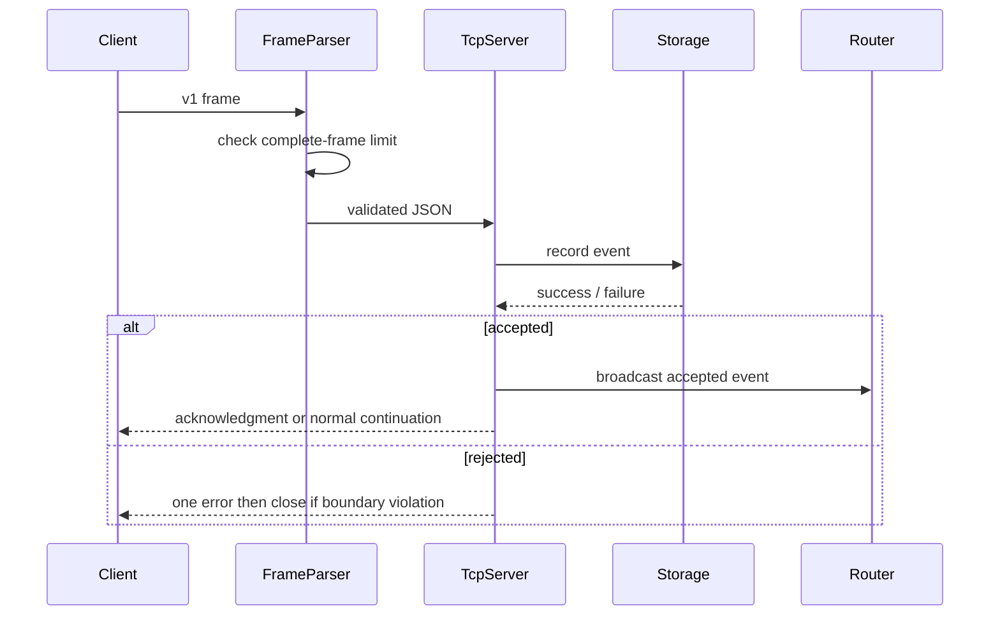
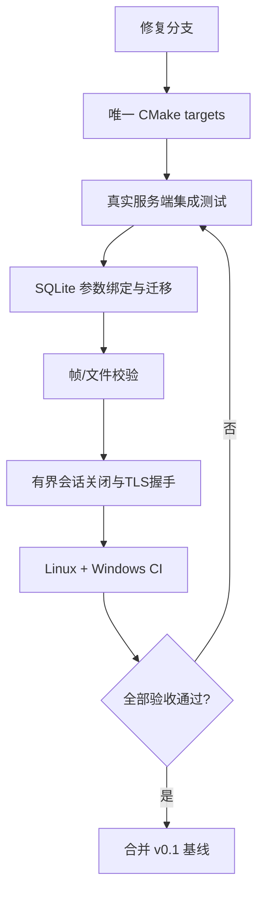
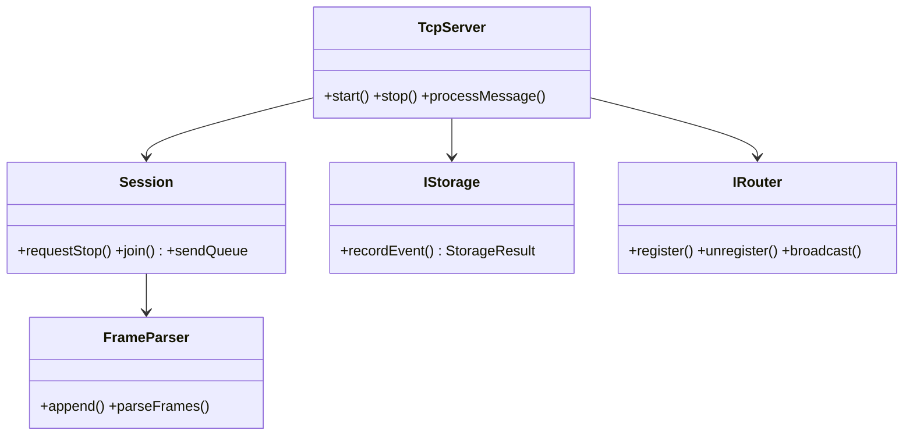

# v0.1 修复与收敛计划

## Purpose

将当前重构中发现的构建阻断、安全缺陷、协议脱节和无效测试转化为可验收的实施计划。完成本计划后，仓库应恢复为可在支持依赖的开发机与 CI 上配置、构建、测试的 v0.1 基线；本计划不实现 JWT、设备密钥、v2 协议或插件系统。

## Implementation Status

本计划已于 2026-07-31 在代码层完成：根构建使用唯一 target，共享 v1 契约、参数化 SQLite、可 join 会话、有界帧/队列、原子文件提交、安全配置迁移、Linux/Windows CI 和四个 CTest 目标均已接线。Linux 本机构建和全部 CTest 已通过；Windows 由 `.github/workflows/ci.yml` 在 MSYS2 UCRT64 环境构建 GUI、双服务端和测试，运行完整 CTest 后生成带运行库的 x64 ZIP。JWT、设备密钥、v2、PostgreSQL 和插件仍严格保留在后续里程碑。

## Background

现有改动引入了根 `CMakeLists.txt`、`client_common`、帧解析器、服务端接口和 SQLite 事件存储。其目标与架构文档一致，但接线尚不完整：根目录同时添加了同名的两套服务器和 GUI 目标；SQLite 的 SQL 由不可信字符串拼接；服务端在停止时会释放仍被 detached 线程与路由器回调引用的连接；新的协议辅助函数与已运行的 v1 字段不同；测试没有运行真实服务端。

## Design Goals

- 保持现有 v1 线上字段和用户可见行为兼容，不在本次引入 v2。
- 让每一项新抽象都有唯一实现、唯一契约和真实的自动化测试。
- 让非法输入、慢连接和关闭流程不能造成 SQL 注入、内存无界增长、阻塞接入或 use-after-free。
- 使 Linux CI 和 Windows CI 的依赖、目标和测试集合保持一致。

## Architecture

本次保留模块化单体方向，但收敛为以下关系：平台 GUI 只链接 `client_common`；CLI 继续使用已验证的 v1 实现；两个服务器入口链接同一个 `server_common` 源集，但拥有唯一 CMake target 和唯一产物名；`TcpServer` 仍是协调器，`FrameParser` 负责有界分帧，`IStorage` 使用可报告失败的持久化接口，`MemoryRouter` 只保存活跃连接。

## Detailed Design

### 批次 A：恢复根构建和 CI

1. 根 CMake 必须为四个产物使用全局唯一 target：`remote_clipboard_server_64`、`remote_clipboard_server_512`、`remote_clipboard_linux_gui`、`remote_clipboard_windows_gui`。可以设置 `OUTPUT_NAME` 保持用户侧二进制名称，但不得再用子目录 `PROJECT_NAME` 间接命名 target。
2. 只在对应宿主平台添加 GUI：Windows 添加 Windows GUI；Linux 添加 Wayland GUI。若要跨编译，使用明确的 `RC_BUILD_WINDOWS_GUI` / `RC_BUILD_WAYLAND_GUI` 选项而非默认同时构建。
3. 将共有服务端源文件整理为一个 `server_common` 静态库或 object library，避免两个入口复制源列表和编译定义。将旧 GUI 内嵌 `tcpserver.*` 从 GUI 产物移除，或迁移到 `legacy/` 并不参与默认构建。
4. `vcpkg.json` 必须将 OpenSSL 纳入 Windows 服务端依赖；CI 应显式提供 Qt 和 GTest，或关闭与当前 job 无关的 GUI/测试。测试不可依赖未锁定的网络下载；优先使用包管理器或固定哈希的 FetchContent。
5. 修正 README：只有根构建与 CI 均通过后，才将其称为“推荐”；更新 Windows 和 Linux 的真实产物名。

### 批次 B：修复 SQLite 与持久化语义

1. `SqliteStorage::recordEvent` 必须使用 `sqlite3_prepare_v2`、`sqlite3_bind_text`、`sqlite3_bind_int64` 和 `sqlite3_step`，严禁拼接 SQL。`device_id`、`sender`、`type`、工作区和摘要均视为不可信。
2. 使用 `filetransfer::sha256Hex` 或 OpenSSL EVP 对规范化内容计算 SHA-256；不要使用 `std::hash`。若只保存元数据，明确该摘要不是去重键；若需要去重，定义不可变 `event_id` 和数据库唯一约束。
3. `IStorage::recordEvent` 改为返回结果（成功、可重试失败、永久失败），服务端仅在持久化语义满足时确认事件。v0.1 可采用“路由继续、日志失败可观测”的策略，但必须记录结构化错误；不可伪装为已持久化。
4. 持久化所有已成功接收的 v1 事件，或在 README 中明确 SQLite 只记录 `clipboard_text`。`--sqlite` 应进入 `ServerAppConfig` 并被保存/加载；入口必须在启用失败时非零退出或明显降级。
5. SQLite schema 加入 `schema_migrations`、必要索引和最小事件字段；数据库文件与 `received_files/` 必须被 `.gitignore` 排除。

### 批次 C：收紧协议边界与文件传输

1. 选择现有 v1 作为唯一事实源：`file_transfer_start` 使用 `transfer_id`、`name`、`size`、`sha256`、可选 `mime`；chunk 使用 `transfer_id`、`seq`、`data`；complete 使用 `transfer_id`。更新 `client_common/protocol.h` 与全部测试，或者删除该文件直到真正接入。
2. 将协议构造与校验集中在一个共享实现；测试必须调用该实现，不能复制一套 `make*` 函数。
3. `FrameParser::append` 与逐行提取均须在分配/解析前执行上限检查。完整行长度超过限制时，清除该连接状态、返回一次错误并关闭连接；不得先解析再检查。使用读取游标或 deque 避免反复 `erase(0, n)` 的二次复杂度。
4. `persistFiles` 和 `handleChunkTransfer` 改为返回成功状态。仅在 bundle 已完整校验、chunk 已接受、complete 已提交后向其他客户端广播；无效开始、未知 transfer、错误 Base64、超量、顺序错误或摘要错误均不得广播。
5. 分块状态记录 `next_sequence`、声明大小、累计字节与过期时间；拒绝跳号、重复、负/溢出大小和超额传输。临时文件写到受限工作目录，成功后原子 rename 到接收目录。

### 批次 D：修复连接生命周期与可用性

1. 删除 detached 线程模型。采用可 join 的会话线程集合，或固定 I/O/worker pool；`stopServer` 必须先停止接收，再通知会话退出，关闭 socket 唤醒阻塞读，join 所有线程，最后释放 SSL/清空路由器。
2. 路由器必须在关闭前注销所有会话；发送回调不应捕获可能被释放的裸生命周期。为每个会话维护 `closing` 状态与有界发送队列。
3. TLS 握手不能在主 accept 循环无限阻塞。将握手交给受限 worker，设置握手 deadline 与最大并发握手数；超时关闭 socket。
4. 对连接数、认证失败、未认证缓冲、每会话传输数、总上传字节和每工作区速率设置上限。慢消费者超出发送队列预算时断开或丢弃可重放投递，不能阻塞发布者。
5. 生产配置默认强制 TLS 及证书验证；开发环境的不安全 TLS 必须显式 opt-in。不要打印密码；配置中的密码迁移为 secret 引用或至少明确标注仅开发用途。

### 批次 E：使测试成为证据

1. `sqlite_storage_test` 必须编译 `sqlitestorage.cpp`，并新增单引号、分号和恶意 `device_id` 的注入回归用例，验证表仍存在且值按原文保存。
2. 用真实 `TcpServer` 替换测试内嵌 `SmokeServer`。测试须在随机空闲端口上启动真实 64MB 服务器，覆盖认证、文本广播、错误帧不广播、分块乱序拒绝、帧超限断开、SQLite 事件写入和停服后线程收敛。
3. 为 `client_common/protocol.h` 添加单一契约测试，断言生成 JSON 与真实服务端所接受字段一致；测试应构建并链接使用该库的 GUI 核心或纯协议目标。
4. CI 需运行 `cmake -S . -B build`、构建、CTest、格式检查；Windows job 至少构建服务器与测试，Linux job 额外构建 Wayland GUI。所有 job 均不得因目标重名、缺依赖或网络下载而偶发失败。

## Sequence Diagrams

## Flow Charts

## UML when appropriate

## Future Extension

本计划完成后才进入 v0.2：将 `PasswordIdentityService` 替换为 JWT/设备配对，逐步引入 v2 协议协商，并在保留 v1 契约测试的条件下建立迁移网关。线程池、事件存储和路由接口应通过指标决定是否拆为独立服务，而不是预先拆成微服务。

## Risks

重命名 CMake target 可能影响脚本和用户侧自动化；必须通过 `OUTPUT_NAME` 与更新后的安装脚本维护兼容。收紧帧和队列限制会拒绝过去可接受的大消息；应发布明确错误与可配置、受上限约束的迁移参数。重做线程生命周期容易引入死锁；所有关闭路径需由压力和反复 start/stop 测试覆盖。

## Trade-offs

本计划有意不实现完整 v2、数据库历史、JWT 或插件，以尽快获得可信的 v0.1 基线。使用可 join 的会话线程/有界队列比 detached 线程代码更多，但换来确定的资源回收与停止语义。参数化 SQL 和真实集成测试增加开发成本，却是让 SQLite 和服务端重构可被信任的最低条件。

## Acceptance Criteria

- 根目录在 Linux 与 Windows 的预期配置中可配置，且没有重复 target 名；对应平台 GUI 目标只构建一次。
- `ctest --output-on-failure` 包含并通过真实 `TcpServer` 的集成测试、SQLite 注入回归和协议契约测试。
- 任意 `device_id`、`sender`、内容和文件名均不能改变 SQLite schema 或执行额外 SQL。
- 带换行的超限帧、无换行的超限帧、乱序/重复分块和校验失败 bundle 都不会被广播或落盘为最终文件。
- 反复启动、连接、停止服务后，不遗留会话线程、路由器句柄或已关闭 socket 发送；慢 TLS 握手不会阻塞新连接。
- README、CMake、CI 与实际产物/依赖一致；生产默认不会忽略 TLS 证书错误或打印密码。
